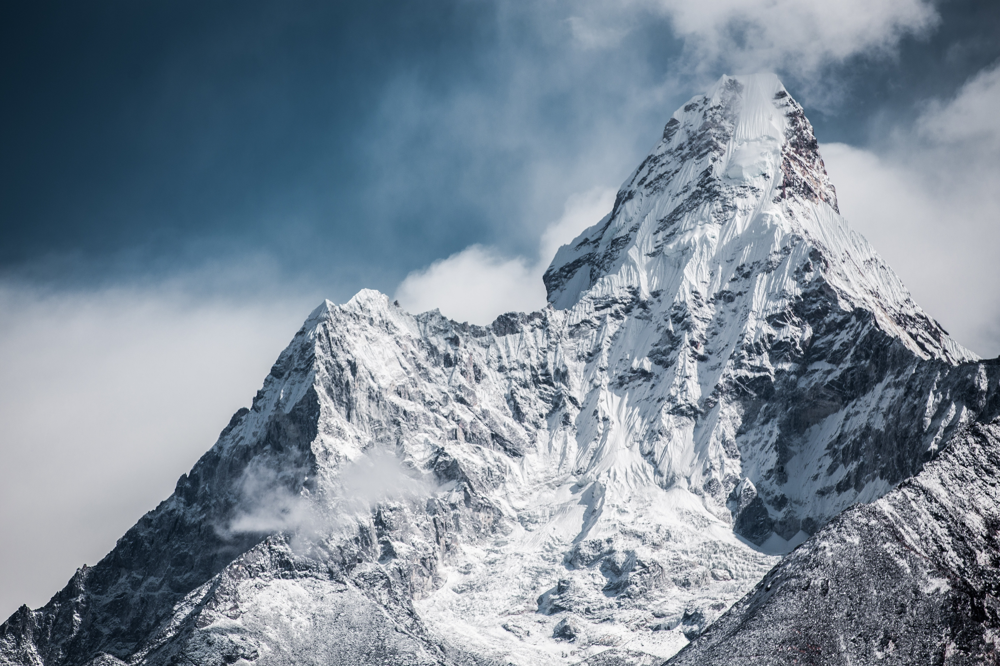

Mount Everest is Earth's highest mountain above sea level, located in the Mahalangur Himal sub-range of the Himalayas. The China–Nepal border runs across its summit point. The current official elevation of 8,848 m (29,029 ft), recognised by China and Nepal, was established by a 1955 Indian survey and subsequently confirmed by a Chinese survey in 1975.

