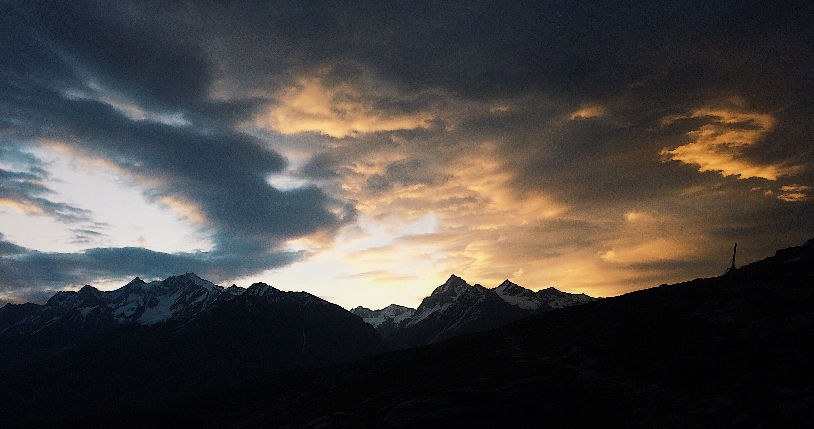

Rohtang Pass is a high mountain pass on the eastern Pir Panjal Range of the Himalayas around 51 km (32 mi) from Manali. It connects the Kullu Valley with the Lahaul and Spiti Valleys of Himachal Pradesh, India. The pass is open from May to November. It is not particularly high or difficult to cross on foot by Himalayan standards, but it has a well-deserved reputation for being dangerous because of unpredictable snowstorms and blizzards.

